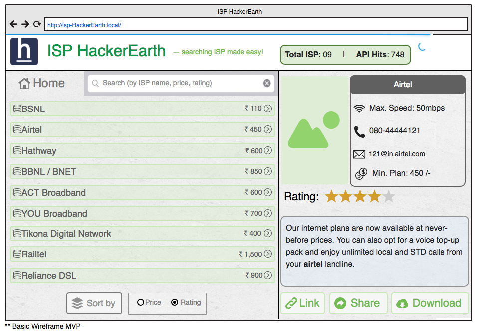

# [Full Stack] ISPHackerEarth — a convenient way to list service providers!
Problem statement for HackerEarth FullStack Challenge

ISPHackerEarth — a convenient way to list service providers!

[Problem Statement]

Build a pseudo web application to list service providers and browse them.

[Minimum Requirement]

— Use of Web API to fetch Data.

* DataSet Parameters:

providers[7] —> { name, lowest_price, rating, max_speed, description, contact_no, email, image, url }

— Visually interactive responsive design listing all the providers.

— Submit Source code, screenshots with necessary instructions.

[Plus Point]

— A feature to Download (as PDF or JPG) ISP details.

— Provider description page displaying provider’s name, description, images, rating, speed, contact_no and email.

— Feel free to use your favourite Development framework/tools in development and design.

* Preferable Stack: Materialise CSS, HTML5, and any JS framework (preferably ReactJS)

— You may add portfolio activity comprising awesome work you have done on web applications.

— Use your imagination and add features which would make things easier for end users.

[Advance Level]

— Plus if you can manage to host this web app somewhere and share Demo URL with us! (heroku, openshift, AWS)

— A feature to Sort (by Price or Rating) ISP.

— Implement Search (by name, price or rating wise) feature.

— Link (Utilise target=“_blank")

— Share provider’s details (including image) across Social Media.

— Custom responsive design, app icon, font and indicators to make web app more user-friendly.

[Guide]

— ISP Details (API):

— Archive Source, Screenshots and Documentation in ZIP file and upload it.

— Ideal Stack:

* Front-end technology stack should be any JS framework (preferably ReactJs) , materializecss to make user experience smoother!

* You may use ReactJS and flux architecture.

* For backend: Use any development framework to handle Download feature.

* Good if you can come up with custom CSS (SASS/LESS), HTML5.

— You may use below resources for bootstrap, typography, icons and subtle texture:

http://materializecss.com/getting-started.html

http://fortawesome.github.io/Font-Awesome/

http://glyphsearch.com/

http://codepen.io/nicholascm90/pen/ojLvMY (sample ReactJS)

— PS: Reference Wireframe design/mockup of the App helps kickstart the design and development work.

[Wireframe MVP / Reference Structure]

Mockup image with instructions

Web app comprising ISP details and misc. feature.

— API Specs (shall be accessible once event starts) —

API Status: https://hackerearth.0x10.info/api/uptime

Supports GET/POST/PUT requests on HTTP as well as HTTPS.

Output Response: JSON, CSV or XML

Example urls:

* https://example.com/api/isp?type=json&query=list_isp

* https://example.com/api/isp?type=json&query=api_hits

HTTP Header

* access-control-allow-headers:Origin, X-Requested-With, Content-Type, Accept

* access-control-allow-methods:GET, POST, PUT

* access-control-allow-origin:*

* server:cloudflare-nginx

Structure: Data Parameters:

providers[7] —> { name, lowest_price, rating, max_speed, description, contact_no, email, image, url }

* name AS text (ISP name)

* lowest_price AS number (lowest tariff price)

* rating AS float (customer rating of ISP)

* max_speed AS text (maximum bandwidth provided by ISP)

* description AS text (ISP detail)

* contact_no AS text (contact number / helpline number)

* email AS text (email address of Internet Service Provider)

* image AS text (image link)

* url AS text (Link to ISP’s portal page)